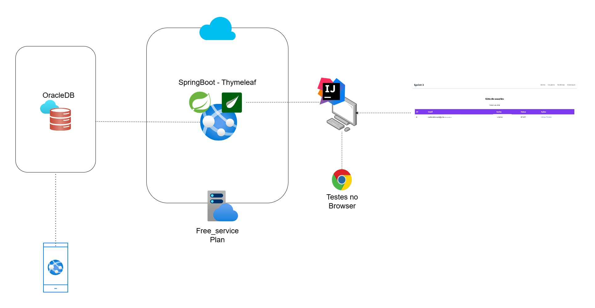
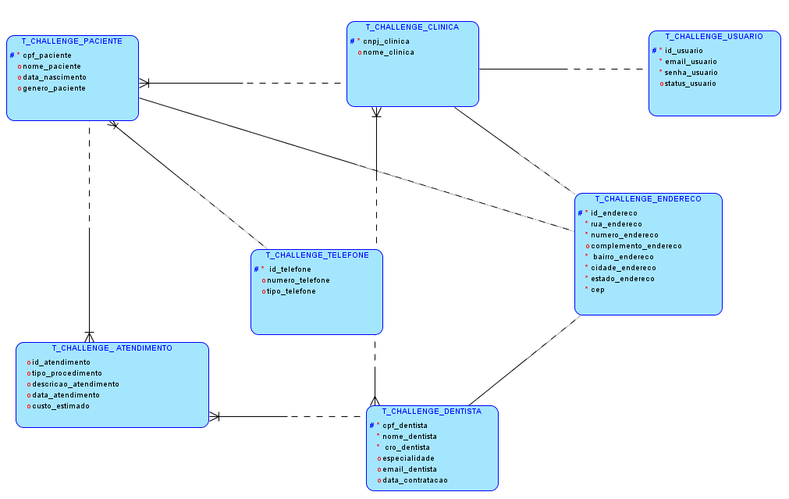
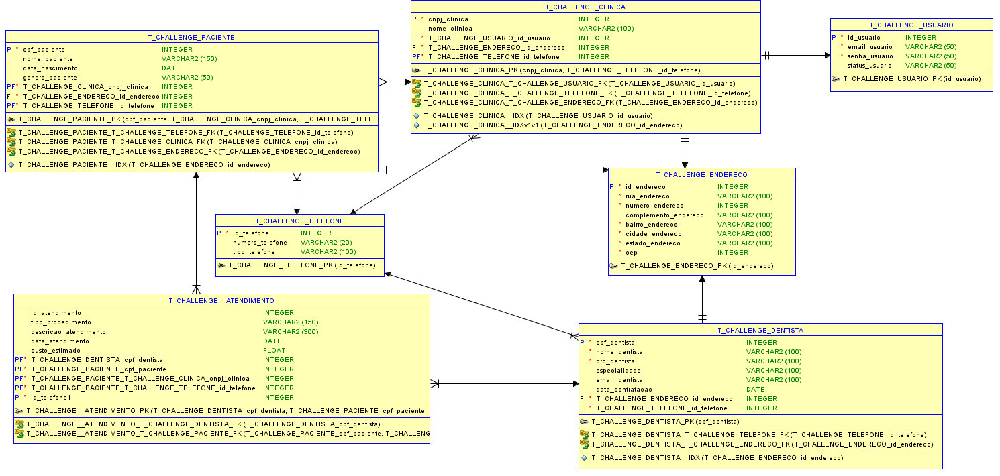
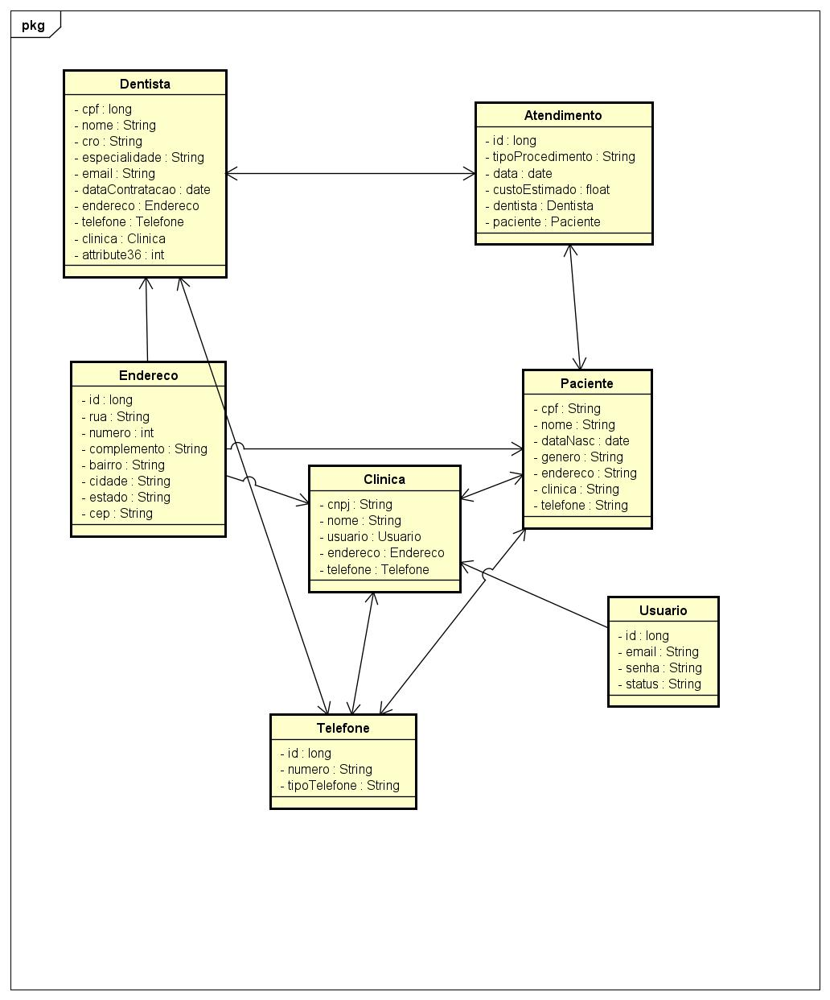

## Dental Insurance API

#### Visão Geral

A API Dental Insurance gerencia dados de clínicas odontológicas, pacientes, dentistas e atendimentos, servindo como base para um aplicativo móvel de armazenamento de informações sobre sinistros odontológicos. Ela permite operações CRUD para essas entidades, oferecendo um maior controle para administração dos dados. Essas informações serão usadas para rastrear sinistros relacionados aos atendimentos.

O projeto tem funcionalidades de front-end utilizando Thymeleaf. 
A aplicação é implantada no Azure Web App para ser acessada através de um navegador.

---

### Vídeo
https://youtu.be/OgE3bOhxkJc

---
### URL DO WEBAPP

https://dental-insurance-odprv.azurewebsites.net/

Endpoints contendo CRUD: 

- /usuarios
- /telefones
- /enderecos
---

### Como fazer o deploy

Abrir o projeto e digitar esse comando no terminal:
 
``
./gradlew bootJar
``
 
 
O arquivo .jar ficará disponível na pasta
 
``
build/libs/
``
 
 
Abra o portal do Azure e Crie o WebApp com as seguintes stacks
- Runtime Stack: Java - 21
- WebServer: JAVA SE
- Windows

Em seguida, acesse o Kudu no Portal do Azure, abrindo o Kudu Console

- No Kudu Console, digite o comando:
``
cd /home/site/wwwroot
``
- Arraste o arquivo .jar gerado para o wwroot
- Digite esse comando no terminal do Kudu
``java -jar nome-do-arquivo.jar``

E pronto! a aplicação estará disponivel no WebApp 

---

## Diagrama de DevOps

---
# Diagramas de Entidade e Relacionamento

[Clique aqui para ver o SQL do banco de dados](src/main/resources/ddl.sql)

#### Relacionamentos

- Usuários estão associados a clínicas. Cada clínica pode ter um único administrador.
- Endereços são compartilhados entre clínicas, pacientes e dentistas, permitindo reutilização e evitando duplicação de dados.
- Pacientes e dentistas estão associados a clínicas, o que indica que eles estão vinculados a um único local de atendimento.
- Atendimentos estão diretamente relacionados a pacientes e dentistas, permitindo o rastreamento de qual atendimento foi realizado por qual dentista e para qual paciente.
- Telefones podem ser associados a clínicas, pacientes e dentistas, permitindo que cada entidade tenha seus números de contato.

# Diagrama de Classes

# Equipe do Projeto

## 🚀 Integrantes

### 1. Alissa Silva Cezero - RM 553954
  ### [GitHub/lissCez](https://github.com/lissCez)

### 2. Melissa Barbosa de Souza - RM 552535
  ### [GitHub/melissabsouza](https://github.com/melissabsouza)

### 3. Nicolas Paiffer do Carmo - RM 554145
  ### [GitHub/NPaiffer](https://github.com/NPaiffer) 

